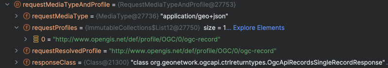

# OGCAPI-Records Link Management

For OGCAPI-Records, links between objects are created.  

The link management interacts strongly with the Content Negotiation System.  One of the "hard" things is many return objects have sub-objects (i.e. `/items` and `/collections` endpoints).  These need to be annotated with "`alternative`" and "`self`" correctly, which can be very difficult.

## Basic Functionality

Most of the code for links are in the `org.geonetwork.ogcapi.service.links` package (`src/shared/ogcapi-records`).

One of the most powerful methods is in `BasicLinks`:

```java
  public void addLinks(
            RequestMediaTypeAndProfile requestMediaTypeAndProfile,
            Object page,
            String endpointFragment,
            Class<?> linkType)
```

|Parameter | Meaning |
|--------- | ------- |
| requestMediaTypeAndProfile | This is the actual user request - and contains the requested MIME Type and the negotiated profile. See [The Content Negotiation system](new-app.md#content-negotiation-system) |
| page | This is an object that has a `links` property (there isn't a parent class due to the autogeneration).  This will be one of the OGCAPI-Records defined "JSON" objects.|
| endpointFragment | Basically, this is the partial URL for the link (i.e. `collections` would make a `http://localhost:7979/geonetwork/ogcapi-records/collections` link) |
| linkType | This is the `IControllerResult` object for the links. See [The Content Negotiation System](new-app.md#content-negotiation-system)|

Basically, what this method does is:

1. Finds all the `HttpMessageConverters` for the given `linkType`.  See  [The Content Negotiation System](new-app.md#content-negotiation-system)
2. It will create a link for each of these `HttpMessageConverters`
 
    * If the request (`requestMediaTypeAndProfile`) and the `HttpMessageConverters` are the same response object type, then it is marked as either `self` or `alternative` based on their MIMEType and negotiated profile.
    * Otherwise, a link title is generated based on the response object type (`IControllerResult` subclass).

3. The generated links are then attached to the page (via reflection because there isn't a parent class)

### Example 1

Lets take a quick look what happens in a fairly complex page - the `http://localhost:7979/geonetwork/ogcapi-records/collections/<CollectionID>/items?f=json` endpoint.

In `ItemsPageLinks`, we will see this snippet of code with adding 5 sets of links:

```java
    addLinks(requestMediaTypeAndProfile, page, "",  OgcApiLandingPageResponse.class);
    addLinks(requestMediaTypeAndProfile, page, "collections/" + collectionId + "/items", OgcApiRecordsMultiRecordResponse.class);
    addLinks(requestMediaTypeAndProfile, page, "collections/" + collectionId, OgcApiCollectionResponse.class);
    addLinks(requestMediaTypeAndProfile, page, "collections", OgcApiRecordsCollectionsResponse.class);

    addNextPrevious(requestMediaTypeAndProfile, collectionId, page, query);
```

1. The first adds links to the Landing Page (`OgcApiLandingPageResponse`)
2. The second adds self/alternative links to the `items` endpoint (`OgcApiRecordsMultiRecordResponse`)
3. The third adds links to the particular collection description endpoint (`OgcApiCollectionResponse`)
4. The fourth adds links to the all-collections endpoint(`OgcApiRecordsCollectionsResponse`)
5. The fifth adds next/previous links for the `items` endpoint - this is hardcoded.

Lets looks at the second set of links (self/alternative links to the `items` endpoint) for this request:

1. This is a call to the `BaseLinks#addLinks()` method

    * the `requestMediaTypeAndProfile` will be for MIME Type `application/json`, response object `OgcApiRecordsMultiRecordResponse`, and no profile (there aren't any profile for the ogcapi-records json output).
    * the page will be the OGCAPI-Records defined (in the OpenAPI document autogenerated java code) `OgcApiRecordsGetRecords200ResponseDto`
    * the endpoint fragment will be `collections/3bef299d-cf82-4033-871b-875f6936b2e2/items`
    * the `linkType` will be for other `/items` formats (`OgcApiRecordsMultiRecordResponse`)

2. `BaseLinks#addLinks()` will ask the Content Management system for all the `HttpMessageConverter` for `OgcApiRecordsMultiRecordResponse`"

    * `application/json` (OGCAPI-Records defined JSON output)
    * `application/geo+json` (OGCAPI-Records defined JSON output - which is actually Geo-JSON)
    * `application/xml` (This is actually the `CswCollectionMessageWriter` that produces CSW-like output)

3. Each of these links are processed:

    * the `application/json` `HttpMessageConverter` will match the request (`requestMediaTypeAndProfile`) and will be marked with `self`
    * the other `HttpMessageConverter`s will **not** match the request and be marked with `alternative`

The resulting links are:

```json
[
 {
      "rel": "self",
      "type": "application/json",
      "hreflang": "eng",
      "href": "http://localhost:7979/geonetwork/ogcapi-records/collections/3bef299d-cf82-4033-871b-875f6936b2e2/items?f=application/json"
    },
    {
      "rel": "alternative",
      "type": "application/geo+json",
      "hreflang": "eng",
      "href": "http://localhost:7979/geonetwork/ogcapi-records/collections/3bef299d-cf82-4033-871b-875f6936b2e2/items?f=application/geo+json"
    },
    {
      "rel": "alternative",
      "type": "application/xml",
      "hreflang": "eng",
      "href": "http://localhost:7979/geonetwork/ogcapi-records/collections/3bef299d-cf82-4033-871b-875f6936b2e2/items?f=application/xml"
    }
]
```

### Example 2

Lets take a quick look what happens in another fairly complex page - the `http://localhost:7979/geonetwork/ogcapi-records/collections/<CollectionID>/items/<RecordID>?f=application/geo+json` endpoint. This page will include all the `FormatterApi` results.  

The main code is in `ItemPageLinks#addAllLinks()`:

```java
 addLinks(
    requestMediaTypeAndProfile,
    page,
    "collections/" + collectionId + "/items/" + page.getId(),
    OgcApiRecordsSingleRecordResponse.class);
```

See above for what these means.  

The `requestMediaTypeAndProfile` object will be resolved as:



The Content Negotiation System will find four `HttpMessageConverter`s:

* An `application/json` provider that creates the OGCAPI-Records defined JSON output for profiles `http://www.opengis.net/def/profile/OGC/0/ogc-record` and `http://geonetwork.net/def/profile/elastic-json-index`.
* An `application/geo+json` is exactly the same as the `application/json`, but only for profile (`http://www.opengis.net/def/profile/OGC/0/ogc-record`)
* An `application/xml` for profiles `http://geonetwork.net/def/profile/raw-xml` and `http://geonetwork.net/def/profile/datacite`
* An `application/rdf+xml` for profiles `http://geonetwork.net/def/profile/eu-dcat-ap-hvd`, `http://geonetwork.net/def/profile/eu-geodcat-ap`, `http://geonetwork.net/def/profile/dcat`, and `http://geonetwork.net/def/profile/eu-dcat-ap`

The request will match the first formatter with profile `http://www.opengis.net/def/profile/OGC/0/ogc-record` - this link will be marked with `self`, while the others will be marked with `alternative`.

The generated links will be:

```json
[
    {
      "rel": "alternative",
      "type": "application/geo+json",
      "hreflang": "eng",
      "profile": [
        "http://www.opengis.net/def/profile/OGC/0/ogc-record"
      ],
      "href": "http://localhost:7979/geonetwork/ogcapi-records/collections/3bef299d-cf82-4033-871b-875f6936b2e2/items/004571b9-4649-42b3-9c28-a8cdc2bf53c7?f=application/geo+json"
    },
    {
      "rel": "alternative",
      "type": "application/rdf+xml",
      "hreflang": "eng",
      "profile": [
        "http://geonetwork.net/def/profile/eu-dcat-ap-hvd",
        "http://geonetwork.net/def/profile/eu-geodcat-ap",
        "http://geonetwork.net/def/profile/dcat",
        "http://geonetwork.net/def/profile/eu-dcat-ap"
      ],
      "href": "http://localhost:7979/geonetwork/ogcapi-records/collections/3bef299d-cf82-4033-871b-875f6936b2e2/items/004571b9-4649-42b3-9c28-a8cdc2bf53c7?f=application/rdf+xml"
    },
    {
      "rel": "self",
      "type": "application/json",
      "hreflang": "eng",
      "profile": [
        "http://www.opengis.net/def/profile/OGC/0/ogc-record",
        "http://geonetwork.net/def/profile/elastic-json-index"
      ],
      "href": "http://localhost:7979/geonetwork/ogcapi-records/collections/3bef299d-cf82-4033-871b-875f6936b2e2/items/004571b9-4649-42b3-9c28-a8cdc2bf53c7?f=application/json"
    },
    {
      "rel": "alternative",
      "type": "application/xml",
      "hreflang": "eng",
      "profile": [
        "http://geonetwork.net/def/profile/raw-xml",
        "http://geonetwork.net/def/profile/datacite"
      ],
      "href": "http://localhost:7979/geonetwork/ogcapi-records/collections/3bef299d-cf82-4033-871b-875f6936b2e2/items/004571b9-4649-42b3-9c28-a8cdc2bf53c7?f=application/xml"
    }
]
```

Notice that the `application/json` is marked as `self`.  Also, note that the response headers will include:

`Link: <http://www.opengis.net/def/profile/OGC/0/ogc-record>; rel="profile"`

## See Other

* [OGCAPI-Records specification](https://ogcapi.ogc.org/records/#:~:text=OGC%20API%20%2D%20Records%20is%20a,resources%20(metadata)%20are%20exposed.)
* [Creating a new Application](new-app.md)
* [OGCAPI-Records Dynamic Properties](ogcapi-records-dynamic-properties.md)
* [Workshops](workshop.md)
* [The Content Negotiation System](new-app.md#content-negotiation-system)
* [Formatters](formatters.md)