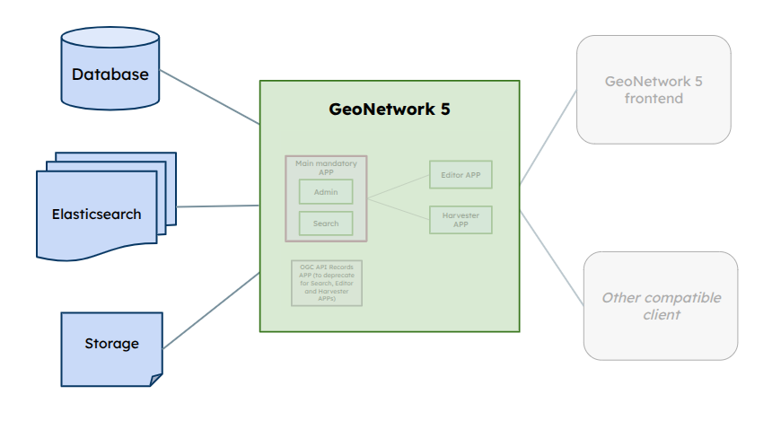
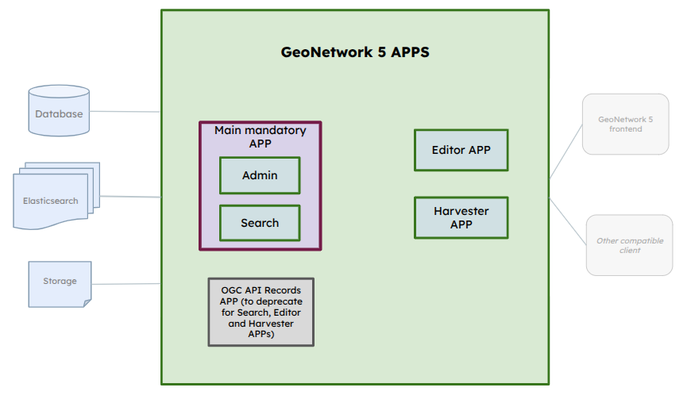

# Architecture overview

The technology infrastructure requirements of GeoNetwork 5 are similar to that of GeoNetwork 4:

The application can be deployed in multiple relational dialects, forcing the use of abstraction layers like JPA/Hibernate rather than native database stored procedures. However, GeoNetwork is optimized to leverage PostGIS geospatial indexes, so there's a natural bias toward Postgres as the recommended and reference configuration.

Another infrastructure requirement of GeoNetwork is the index, used to speed up search functionalities. Also search and content statistics are stored in ElasticSearch using Kibana dashboards to visualize them in the GeoNetwork administration panel. While Kibana is not mandatory except for some statistics and reporting features, GeoNetwork cannot function without Elasticsearch.

GeoNetwork stores some additional data and configuration on the filesystem, although in typical configurations it does not require huge amounts of extra disk space, typically in the order of hundreds of megabytes.

## Deployment modules

The GeoNetwork 5 backend is composed of several independent Spring Boot applications, covering different functional areas.

The GeoNetwork main application covers the search API (including various protocols) and administrative aspects, such as general system configurations and user and security management. The main application is completely independent from the others, while other apps may depend on the main app for general aspects. The Editor APP offers administration, editing, and validation APIs. The Harvester APP offers APIs for configuring, running, and monitoring harvesters.

## Code structure

The code base is organized in the [following structure](https://docs.google.com/document/d/1ZEuaTkGhsSRFhh0Mcgv1vxVQ1D71MttL64iCLFOOyr0/edit?usp=sharing):

📁 **apps**

📁 **modules**

📁 **shared**

The **app** folder contains several Spring Boot apps, each of which contains the code needed to build the apps discussed in the "deployment modules" section. No app should depend on any other app (except generic-geonetwork5, which they all depend on, but it's a sort of base template).

The **modules** folder contains software modules that can be used by one or more *apps*. Each module should ideally be a fully-fledged set of features, with a clear purpose, API or interface, developer documentation, self-consistent tests, and minimal dependencies on other modules (e.g., “*ogcapi-records*” and “*formatter*” modules are a good example, both are independent modules, but *ogcapi-records* includes *formatter* module to implement different outputs for metadata)

The **shared** folder contains software modules such as data models, utilities, and interfaces that serve different parts of the application but are not fully functional in themselves. What is in the *shared* folder can be used by one or more modules in the *modules* folder.