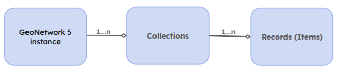

# Terms

GeoNetwork 5 is built around the OGC API Records model. Some concepts from GeoNetwork 4 need to be remapped as follows:

## Metadata ⟶ **Record**

[OGC API Records specification](https://docs.ogc.org/is/20-004r1/20-004r1.html) defines the Records as follows: *atomic unit of information of a catalog that is used to provide information (i.e., metadata) about a particular resource that the publisher of that resources wishes to make discoverable.*

This definition coincides with what we've been calling *Metadata* up to now. All things considered, we can allow ourselves some flexibility with this term.

## Portals/Sources ⟶ **Record Collection/Catalog**

We refer to a *Record Collection* as a set of one or more records, linked by the collection's metadata. [In GeoNetwork 4](https://docs.geonetwork-opensource.org/4.4/administrator-guide/configuring-the-catalog/portal-configuration/), the concept of a *Portal* (or *Source*) allowed for the creation of multiple subportals within the same GeoNetwork or for grouping metadata imported via a harvester from the same source. These concepts and use cases can be completely replaced by the concept of a *Record Collection* (or, in less technical contexts, a *Catalog*). A collection can, in turn, have associated metadata that identifies its nature.

## **Formatter**

A software component of GeoNetwork that can convert a metadata record from one format/standard to another. 

## **Indexer**

Similar to formatter, it is specifically used to convert documents from different formats and standards, received from GeoNetwork into an internal reference format (POJO, Index).