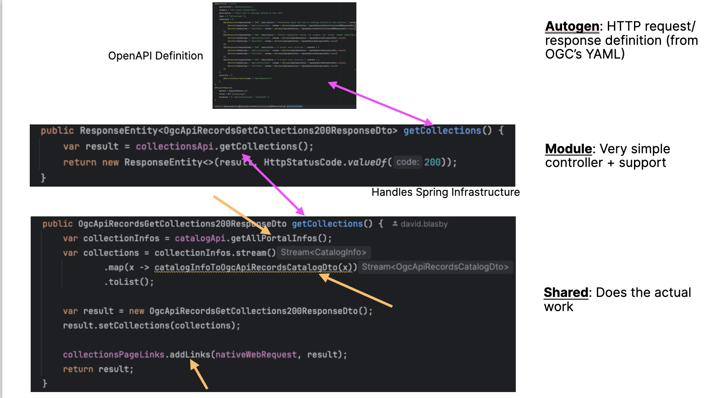

# Technical Overview

Here is a technical overview so developers can easily contribute!

## History

The [GeoNetwork Microservices Project](https://github.com/geonetwork/geonetwork-microservices) had an OGCAPI-Records implementation.  This was used as a basis for the GN5 implementation.

## Development of GN5's OGCAPI-Records

The main development technique was to use the OGC provided [OpenAPI](https://www.openapis.org/) [.yaml definitions](https://github.com/opengeospatial/ogcapi-records/tree/master/core/openapi) to autogenerate all the Controller and Model classes using the [openapi-generator](https://github.com/OpenAPITools/openapi-generator).

Unfortunately, the code generated was difficult to use.  In order to fix this, the .yaml definitions were modified to produce better generated code.

1. Some of the deeply nested inline schemas did not generate java classes - these were moved into their own files.  See the extracted directory (`/src/modules/ogcapi-records/ogcapi-records-openapi-autogen/src/ogc-openapi-schema/openapi/schemas/extracted`).
2. Sometimes classes were generated with a trailing `1` - these definitions need to be, also, moved to their own file.
3. The only interface should be the GeoJSON geometry interface.  Any other interfaces should be investigated - they are typically caused by `oneOf` OpenAPI definitions.  These modifications will make minor changes between the specification and GN5 implementation.  However, in many cases, these are mostly invisible.  
    For example, in the specification, `ID`s can either be a string or integer.  The code generator produces an interface for this.  The OpenAPI .yaml was modified so it is only a string.  However, the parser (Jackson `ObjectMapper`) allows for input as an integer OR string.  However, the output is always a string.
    See the Jackson `ObjectMapper` configuration in `WebConfig.java`.
4. The GeoJSON geometry definition was heavily modified for better parsing and output.  However, the resulting .yaml definition is equivalent. 
5. A few properties are defined as a list OR a single-value.  These were replaced with list-only output.  This produces valid output.
6. The property `itemType` can be either a list OR a single-value.  However, output as a list caused issues with some clients.  It was replaced with a single-value only.  This could cause some issues in the future (in the unlikely situation where there needs to be multiple `itemType`s).
7. BBOX and Time have some minor changes.

Please see the `README.md` files in the code base, and the comments in the .yaml files.

## Modules

The OGCAPI-Records modules are in two sections - `modules` (the codegen and very simple controllers) and `shared` (actual implementation).

|  | 
|:--:| 
| *Example of how the modules are used* |

This diagram shows:

1. At the top - OpenAPI .yaml is used to generate the `Model` and spring-boot java `Controller` definitions.  See `modules/ogcapi-records/gn-ogcapi-records-openapi-autogen`.
2. There is a ***very*** simple controller implementation that hands off processing.  See `modules/ogcapi-records/gn-ogcapi-records-openapi-implementation`.
3. There is an actual implementation (interacts with Elastic and PostgreSQL) and does the actual work.  The vast majority of the code is here. See `shares/ogcapi-records`.

### app/geonetwork

This is the main GN5 application.  There isn't any OGCAPI-Records specific code here (however, see `application.yml`).

### modules/ogcapi-records

There are two sub-modules here:

| <!-- ---> | <!-- ---> |
|---|---|
| gn-ogcapi-records-openapi-autogen| This is the modified OGC's OpenAPI .yaml definitions used to autogenerate code.  There are also several test cases from the specification. |
| gn-ogcapi-records-implementation | This is very simple controllers and spring boot HTTP support. |

### shares/ogcapi-records

This module is where most of the code is located. It interacts with Elastic/PostgreSQL and does conversions between GeoNetwork objects and OGCAPI-Records objects. 

## Elastic JSON Index Record

The OGCAPI-Records mostly interacts with Elastic (and not with GeoNetwork or the underlying XML Metadata records).  This is because the Elastic JSON Index Record has already summarized all different types of Metadata records that GeoNetwork supports.  Therefore, most of the code is:

1. Translating incoming OGCAPI-Records requests into Elastic Queries
2. Translating the Elastic JSON Index Record into the corresponding OGCAPI-Records response objects
3. Adding links to the OGCAPI-Records response documents

NOTE: there is some interaction with the GeoNetwork PostgreSQL database - mostly for the `source` table (for portal/sub-portal definitions) and `user`/`usergroup` for security.

## Conversion from Elastic JSON Index Record to OGCAPI-Records

1. The `indexing` modules already support converting the Elastic JSON Index Record into the `IndexRecord` java object
2. The conversion from the `IndexRecord` java object into the autogenerated OGCAPI-Records java objects is mostly done in the `indexConvert` package (see test cases).

## Elastic Query Generation

There are several classes that are used for Elastic Query Generation.  We are using the new Elastic Java API:

1. `OgcApiQuery.java` - this is a direct representation of the `/collections/<collectionID>` query.  Its is built, from a request, by `QueryBuilder.java`.
2. `RecordsEsQueryBuilder.java` - This was taken from the Geonetwork-microservices project and updated for the new Elastic Java API.  It handles the basic OGC-defined Query.
3. `QueryToElastic.java` - This extends the `RecordsEsQueryBuilder` query with [Queryables](#queryables).
4. `QueryablesExtractor.java` - This converts simple text searches into queryable searches (see [Extra Feature](features.md#extra-features))
4. `ElasticWithUserPermission.java` - This adds a GN security filter to the query so users only see records they have permissions for.  See [security](#security).
5. `SimpleElastic.java` - simple wrapper around the Elastic search client for easy-of-use.

## Queryables

GN5's OGCAPI-Records implementation supports [queryables](https://portal.ogc.org/files/96288#filter-queryables).

### Queryables Configuration

GN5's OGCAPI-Records implementation supports configuring queryables.  You can add queryables for anything in the Elastic Index!

See `queryables.json` in the code base for examples and documentation.

## Security

The OGCAPI-Records implementation is read-only, so the biggest security issue is to ensure that user's cannot access records they don't have access to.

GN5 adds an Elastic `BoolQuery.must()` query to generated queries that checks to see if the record is setup so that the current user is in a group that has permissions for that record.  See `ElasticWithUserPermissions.java` and  [the GN4 permissions documentation](https://docs.geonetwork-opensource.org/4.2/user-guide/publishing/managing-privileges/#viewing).

## Testing

There are some simple test cases for functionality (i.e. parsing, conversions).
Also, this has been tested against several OGCAPI-Records clients (including the STAC Browser).

## Other resources

1. The [OGCAPI-Records Specification](https://ogcapi.ogc.org/records/#:~:text=OGC%20API%20%2D%20Records%20is%20a,resources%20(metadata)%20are%20exposed.)
2. The [OGC's OpenAPI .yaml definitions](https://github.com/opengeospatial/ogcapi-records/tree/master/core/openapi)
3. The [GN5 GitHub Code Base](https://github.com/geonetwork/geonetwork)
4. See the README.md files in the code base
